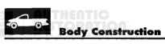
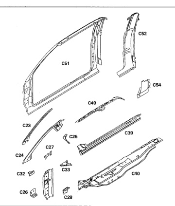

### y Construction Characteristics

*Fig. 1*

The body side aperture is made up of several components layered and welded together. All components are serviced separately.

1. Windshield side opening frame reinforcement (C23).

2. Windshield side opening frame (C24).

3. Cowl to pillar inner reinforcement (C25).

4. Body side hinge pillar upper tapping plate (C26).

5. Retractor mounting reinforcement (C27).

6. Body side hinge pillar lower tapping plate (C28)

7. Aperture to fender bracket (C32).

8. Cowl side to floor reinforcement (C33).

9. Sill reinforcement (C39).

10. Outer floor pan (C40).

11. Half-door inner rail (C49),

12. Half-door body side aperture (C51).

13. Quarter outer panel (C52).

14. Quarter inner panel (C54).

*Fig. 2*
