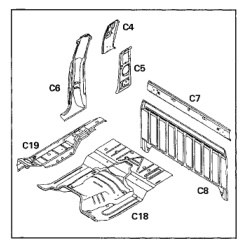
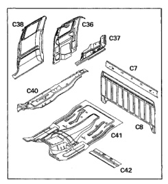

The back panel and reinforcement panel are serviced separately. Both panels are welded in place.

1. Rear quarter inner upper panel (C4).

2. Rear quarter inner lower panel (C5).

3. Rear quarter outer panel (C6).

4. Cab back reinforcement (C7).

5. Cab back panel (C8).

6. Center floor pan (C18).

7. Outer floor pan (C19).

The back panel, reinforcement and extension are serviced separately. The extension panel is secured with structural adhesive and spot welds. The other panels are welded and sealed.

1. Cab back reinforcement (C7).

2. Cab back panel (C8).

3. Rear quarter inner upper panel (C36).

4. Rear quarter inner lower panel (C37).

5. Rear quarter outer panel (C38).

6. Outer floor pan (C40).

7. Center floor pan (C41).

8. Rear seatbelt anchor reinforcement (C42).

*Fig. 1*

*Fig. 2*
