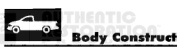
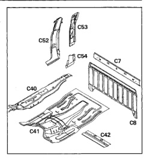
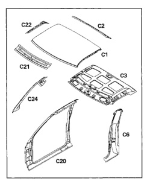

*Fig. 1*

The back panel and reinforcement panel are serviced separately. Both panels are welded in place.

1. Cab back reinforcement (C7).

2. Cab back panel (C8).

3. Outer floor pan (C40).

4. Center floor pan (C41).

5. Rear seatbelt anchor reinforcement (C42).

6. Quarter outer panel (C52).

7. Quarter inner upper panel (C53)

8. Quarter inner lower panel (C54)

The roof structure consists of inner and outer roof panels along with front and rear headers and side rails. All panels are serviced separately. Structural adhesive and spot welds are used to secure the panels.

1. Roof outer panel (C1).

2. Rear header panel (C2).

3. Roof inner panel (C3).

4. Rear quarter outer panel (C6).

5. Body side aperture (C20).

6. Front header panel (C21).

7. Roof side inner rail (C22).

8. Windshield side opening frame (C24).

*Fig. 2*

*Fig. 3*
