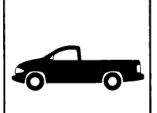
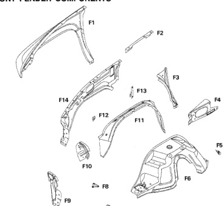

### ODY CONSTRUCTIO CHARACTERISTICS Dodge Ram Pickup

FRONT FENDER COMPONENTS

F7

Outer Fender Panel Upper Fender Reinforcement Fender Aperture Reinforcement Front Fender Reinforcement Inner Wheelhouse to Floor Reinforcement Inner Front Wheelhouse Panel Inner Fender to Wheelhouse Reinforcement

F1

F2

F3 E4

F5

F6

F7

*Fig. 1*

Hom Tapping Plate Lower Headlamp Mounting Panel Upper Headlamp Mounting Panel Outer Front Wheelhouse Panel Inner Fender to Battery Tray Reinforcement Inner Fender Tapping Plate Inner Fender Panel

F8

Ed F10

F11 F12 F13

F14

F2-F5, F7-F14: Not serviced separately

*Fig. 2*
