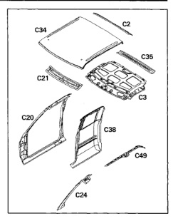
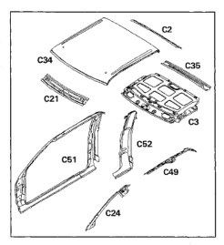

The roof structure consists of inner and outer roof panels along with front and rear headers and side rails. All panels are serviced separately. Structrual adhesive and spot welds are used to secure the panels.

1. Roof header panel (C2).

2. Roof inner panel (C3).

3. Body side aperture (C20).

4. Front header panel (C21).

5. Windshield side opening frame (C24).

6. Roof outer panel (C34).

7. Roof bow (C35).

8. Rear quarter outer panel (C38).

9. Half-door inner rail (C49).

The roof structure consists of inner and outer roof panels along with front and rear headers and side rails. All panels are serviced separately. Structural adhesive and spot welds are used to secure the panels.

1. Roof header panel (C2).

2. Rear header panel (C3).

3. Front header panel (C21).

4. Windshield side opening frame (C24).

5. Roof outer panel (C34).

6. Roof bow (C35).

7. Half-door inner rail (C49).

8. Half-door body side aperture (C51).

9. Quarter outer panel (C52)

*Fig. 1*

*Fig. 2*
