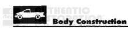
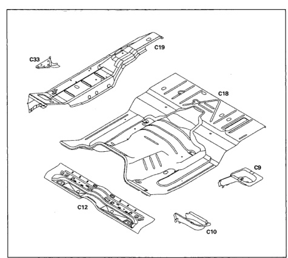

*Fig. 1*

*Fig. 2*

The floor pan is made up of several components layered and welded together. All panel are serviced separately.

1. Rear body hold-down support (C9).

2. Front body hold-down support (C10).

3. Seatbelt anchor reinforcement (C12)

4. Center floor pan (C18).

5. Outer floor pan (C19).

6. Cowl side to floor reinforcement (C33).
