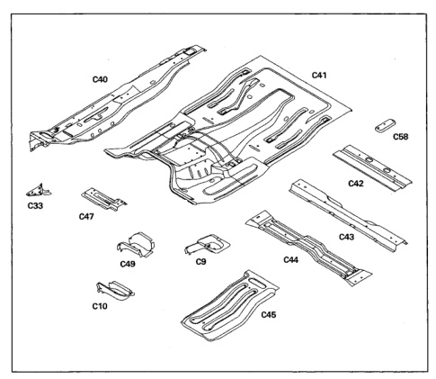

*Fig. 1*

*Fig. 2*

The floor pan is made up of several components layered and welded together. All panels are serviced separately.

1. Rear body hold-down support (C9).

2. Front body hold-down support (C10).

3. Cowl side to floor reinforcement (C33).

4. Sill reinforcement (C39).

5. Outer floor pan (C40).

*Fig. 3*

### Body Construction Characteristics

6. Center floor pan (C41)

7. Rear seatbelt anchor reinforcement (C42).

8. Rear floor crossmember (C43).

9. Front seat mounting rear crossmember {C44}.

10. Center floor reinforcement (C45).

11. Front seat mounting front support (C47). 12. Half-door inner rail (C49).

*Fig. 4*
