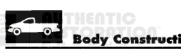
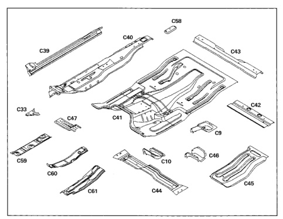

### y Construction Characteristics

*Fig. 1*

The floor pan is made up of several components layered and welded together. All panels are serviced separately.

1. Rear body hold-down support (C9).

2. Front body hold-down support (C10).

3. Cowl side to floor reinforcement (C33).

4. Sill reinforcement (C39).

5. Outer floor pan (C40).

6. Center floor pan (C41).

7. Rear seatbelt anchor reinforcement (C42).

8. Rear floor crossmember (C43).

9. Front seat mounting rear crossmember (C44).

10. Center floor reinforcement (C45).

11. Mid body hold-down support (C46).

12. Front seat mounting front support (C47).

13. Front seat mounting rear support (C58).

14. Lower heat shield (C59). . . . . .

15. Upper heat shield, left side (C60).

16. Upper heat shield, right side (C61).

*Fig. 2*
