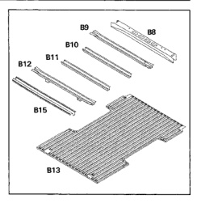
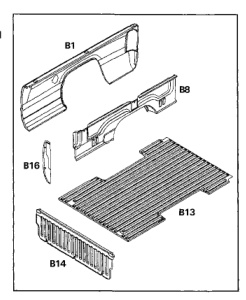

All components of the cargo box floor assembly are serviced separately. All panels are welded together.

1. Box, rear crossmember (B8).

2. Box, crossmember (B9).

3. Box, center crossmember (B10).

4. Box, center crossmember (B11).

5. Box, crossmember (8 foot only) (B12).

6. Box, floor panel (B13).

7. Box, front crossmember (B15).

The cargo box front closure is made up of several panels, each serviced separately.

1. Box, side outer panel (B1).

2. Box, floor panel (B13).

3. Box, front center panel (B14).

4. Box, side front panel (B16).

5. Box, side inner panel (B18).

*Fig. 1*

*Fig. 2*
