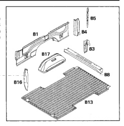
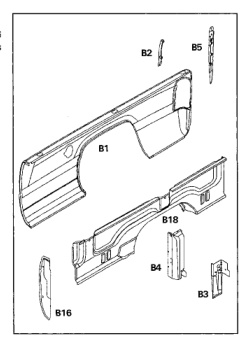

*Fig. 1*

The cargo box inner side panel is basically the same for the 6 foot and 8 foot versions. The 8 foot version has one additional stake pocket in the center. All panels and components are welded together and are serviced separately.

1. Box, side outer panel (B1).

2. Rear corner to rear sill gusset (B3).

3. Outer rear corner reinforcement (B4).

4. Box, side rear reinforcement (B5).

5. Box, rear crossmember (B8).

6. Box, floor panel (B13).

7. Box, side front panel (B16).

8. Rear wheelhouse inner panel (B17).

The outer box side panel is the same for the 6 foot and 8 foot versions, except the 8 foot has the extra stake pocket in the center.

1. Box, side outer panel (B1).

2. Taillamp mounting bracket (B2).

3. Rear corner to rear sill gusset (B3).

4. Outer rear corner reinforcement (B4).

5. Box, side rear reinforcement (B5).

6. Box, side front panel (B16).

7. Box, side inner panel (B18).

*Fig. 2*

*Fig. 3*
