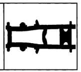
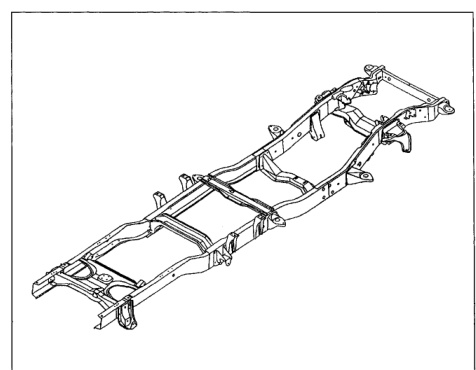

*Fig. 1*

### FRAME CONSTRUCTIO CHARACTERISTICS

### Dodge Ram Pickup

The Dodge Ram Pickup uses an exclusive patented three-section frame design that provides exceptional frame strength and stiffness. The construction of each of the three sections provides the special level of strength and stiffness needed by each part of the vehicle. The ends of

the center section are swaged to fit into the front and rear sections. The front and center sections are welded together, and the center and rear sections are joined by a patented 14-rivet process. The frame is serviced as a complete unit only.

*Fig. 2*
