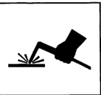

*Fig. 1*

WELDED PANE REPLACEMEN

Dodge Ram Pickup

The basic parts of the body structure are the welded panels. This section contains a brief description of the placement of some of these panels and their weld locations.

NOTE: To ensure the strongest, most durable and cleanest welds possible, perform testing before and during all weld procedures. Always follow American Welding Society specifications and procedures.

Explanation of Manual Contents . Front Fender and Inner Wheelhouse .................................................................................................. 34 Cowl and Dash Panel Roof Panel (Regular Cab) . Roof Panel (Club Cab) Roof Panel (Quad Cab) Body Side Aperture (Reqular Cab) . Body Side Aperture (Club Cab) Body Side Aperture (Quad Cab) Cab Back Panel (Regular Cab) . Cab Back Panel (Club Cab) Cab Back Panel (Quad Cab) Floor Pan (Reqular Cab) Floor Pan (Club Cab) Floor Pan (Quad Cab) . Cargo Box Outer Side Panel . Cargo Box Inner Side Panel . Cargo Box Front Panels . Cargo Box Floor
