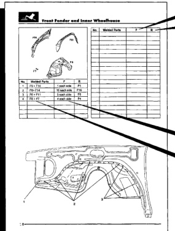

*Fig. 1*

This publication contains information used to repair the body structure of the Dodge Ram Pickup. The information is divided into sections covering the welded body panels (i.e., fenders. cab and box), location and use of structural

Some of the operations for panel replacement are designated by the following symbols:

MIG Plug Weld

Rough cutting of panel to be replaced

Arc Welding

32

adhesives and sealants, bumper configurations and frame dimensions. When servicing a damaged vehicle, please refer to the NOTES WITH REGARD TO REPAIR WORK. These notes are provided to assist in the repair process and ensure a timely and quality repair.

3 2 4 Alternate stitch welds T until you have a Continuous Stitch continuous MIG Weld. MIG Weld

NOTE: Although spot welds are the nuts and bolts of most body structures, they will not be used as a repair symbol because of the lack of proper spot weld equipment in most shops.

"En indicates the number of factory welds to be separated. "R" indicates the number of welds to be made and the method to be used when making repairs.

If only a number is listed under "F" it indicates that the method used at the factory was a spot weld. For all other methods, both the welding method and the number of welds are indicated. For example, "F2, RP2" indicates that the 2 spot welds made at the factory should be replaced by 2 pluq welds if repairs are made.

The welded components are indicated by using the designations given in the illustration below: For example, "a + b" indicates that component "a" and component "b" shown in the top illustration are welded

*Fig. 2*
