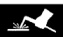
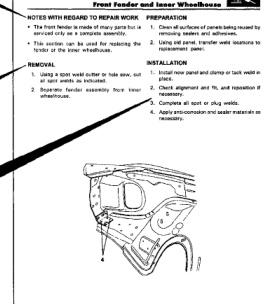

NOTE: Before beginning repair procedures, perform test welds to verify your equipment and to ensure vour welds are the best quality. All welds should conform to the American Welding Society standards.

For weld specifications contact:

American Welding Society 550 Northwest Le Jeune Road P.O. Box 351040 Miami, Florida 33135 Phone: (305) 443-9353

Points which require particular attention during welded panel replacement work.

The panel removal instructions and accompanying illustrations are given in the order in which the work is to be performed.

The panel installation instructions and accompanying illustrations are given in the order in which the work is to be performed.

In order to keep the instructions brief and simple, obvious work procedures (such as removal of a panel after it has been cut) have been omitted where possible.

*Fig. 1*

Certain body components must use sealers to ensure proper assembly. Be sure to check the Body Sealing Locations and Structural Adhesives Sections for location and sealer type.

*Fig. 2*
