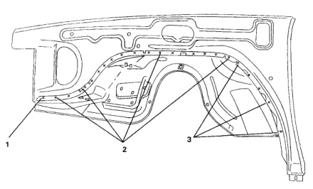

*Fig. 1*

### Front Fender and Inner Wheelhouse

Welded Parts F R No. F14 F11 F6 ---- ...... : F7 No. Welded Parts F R F6 + F14 1 each side P1 1 F6+ F14 P16 טו 16 each side ట F6 + F11 5 each side b5 ﺷ F6 + F7 4 each side P4

*Fig. 2*
