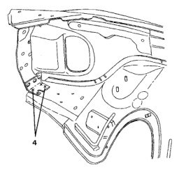

· The front fender is made of many parts but is serviced only as a complete assembly.

· This section can be used for replacing the fender or the inner wheelhouse.

1. Using a spot weld cutter or hole saw, cut all spot welds where indicated.

2. Separate fender assembly from inner wheelhouse.

*Fig. 1*

1. Clean all surfaces of panels being reused by removing sealers and adhesives.

2. Using old panel, transfer weld locations to replacement panel.

1. Install new panel and clamp or tack weld in place.

2. Check alignment and fit, and reposition if necessary.

3. Complete all plug welds.

4. Apply anti-corrosion and sealer materials as necessary.

*Fig. 2*
