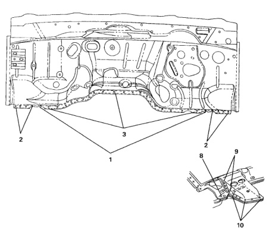

*Fig. 1*

### vl and Dash Panel

No. Welded Parts F R చ C15 + C18 / C41 20 P20 C19 P7 4 C14 + C15 7 each side 5 C13 + C14 + C15 5 each side P7 ELH C13 + C14 + C16 5 ଚିତ୍ର C17 C25 C13 + C14 + C16 ნ e RH P6 C16 7 C15 + C16 33 P33 P19 8 C16 + C17 19 C17 + Steering 9 12 P12 C1F Column Upper Support Steering Column 10 8 P8 Welded Parts F No. R Upper to Lower C15 + C19 + C18(Reg) 1 1 each side P1 Supports /C41 (Club, Quad) C16 + C17 22 P22 C15 + C19 P4 11 2 4 each side ‌‌‌ C15 + C18 / C41 20 P20 12 C13 + C16 + C17 13 P13

*Fig. 2*
