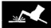
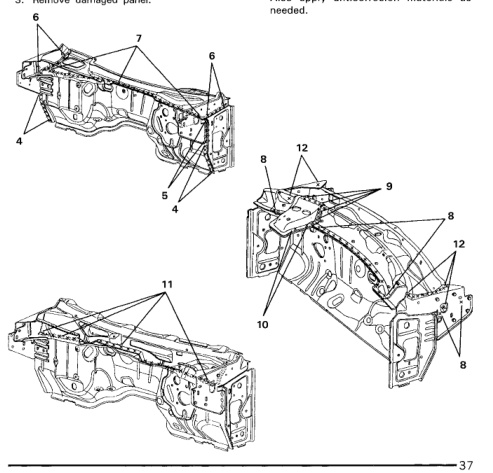

· Use care when removing undamaged panels to gain access to cowl or dash panels.

· Remove all flammable materials before starting any repairs.

1. Carefully cut all spot welds with a spot weld cutter or hole saw.

2. Separate panels with air chisel or other suitable tools.

3. Remove damaged panel.

*Fig. 1*

1. Transfer weld locations to new panel from old.

2. Clean all mating surfaces of adhesive.

1. Test-fit new panel(s) and clamp in place. Double-check fit and alignment.

2. Plug weld new panel(s) at indicated locations.

3. Apply sealers and adhesives as required. Also apply anticorrosion materials as

*Fig. 2*
