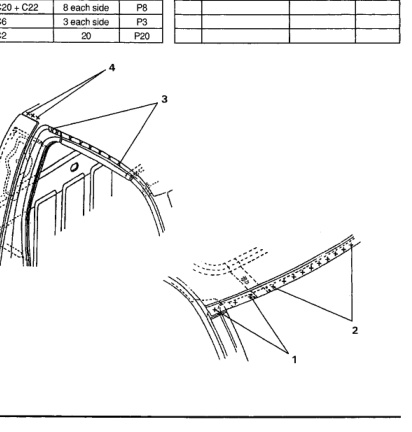

### Roof Panel (Regular Cab)

No. Welded Parts F R C1 C2 C21 C6 C22 C24 C20 Welded Parts No. F R C1 + C20 + C24 1 3 each side P3 C1 + C21 2 P10 10 each side C1 + C20 + C22 చ 8 each side P8 C1 + C6 3 each side P3 4 C1 + C2 5 20 P20

*Fig. 1*
