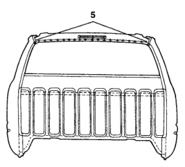

• · Take care when handling a roof panel. The panels can be easily damaged by mishandling.

· Be sure to use the recommended adhesive for the roof bows.

· Before heating roof panel to soften old adhesive, make sure all flammable materials are removed from roof inner and outer areas.

1. Cut and separate the spot-weld locations, being careful not to damage any other paenls.

2. Heat the top of the roof panel at the areas where it has adhesives applied. This will make it easier to remove.

3. Remove the old roof panel.

4. Remove any old adhesive on roof braces, using a mule skinner's wire brush or something as aggressive.

*Fig. 1*

1. Temporarily align and mount the new roof panel onto the body. Make corresponding reference marks on the panel and body structure for later use.

2. Use the old roof panel as a template to mark locations for plug welds on the new roof panel.

3. Apply the adhesive to the roof bows and place roof panel into position as marked previously.

4. After a double check for alignment, clamp panel down.

5. Plug weld the roof into place.

6. Finish seams as required.

*Fig. 2*
