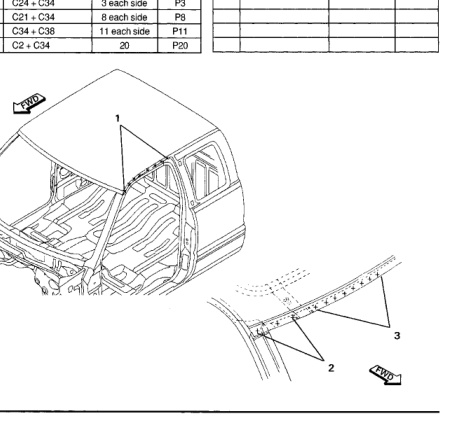

### Roof Panel (Club Cab)

Welded Parts R No. F C34 C2 C38 C21 C20 0 C49 C24 13 Welded Parts F R No. C20 + C34 + C49 P8 1 8 each side 2 C24 + C34 3 each side P3 ట C21 + C34 P8 8 each side C34 + C38 4 11 each side P11 C2 + C34 5 20 P20

*Fig. 1*
