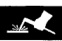
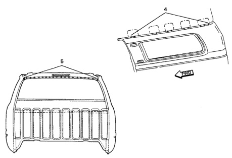

· Before heating the Roof Panel to soften old adhesive, make sure all flammable materials are removed from roof inner and outer areas.

· Take care when handling the Roof Panel. The panel can be easily damaged by mishandling.

· Be sure to use a good structural adhesive for the roof bows.

1. Cut and separate the spot welded locations, being careful not to damage any panels.

2. Heat the top of the Roof Panel where adhesives are applied. It will make it easier to remove.

3. Remove the Roof Panel.

4. Remove any old adhesive on roof braces using a mule skinner's wire brush or something as aggressive.

*Fig. 1*

1. Temporarily alian and mount the new Roof Panel onto the body. Make corresponding reference marks on the Roof Panel and body structure.

2. Use the old Roof Panel as a template to mark locations for plug welds on the Roof Panel.

3. Apply the adhesive to the Roof Bows and other mating surfaces and place the Roof Panel into position as marked previously.

4. After checking alianment and adiusting as necessary, clamp the panel down.

5. Plug weld the roof panel in place.

6. Finish seams as required.

*Fig. 2*
