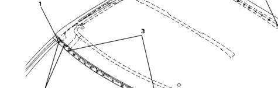

### loof Panel (Quad Cab)

F No. Welded Parts R C34 + C52 ნ 3 each side P3 C34 7 C2 + C34 20 P20 C21 C2 C51 C52 C3 0 C49 C24 F R No. Welded Parts C24 + C34 1 1 each side P1 2 C3 + C24 + C34 P2 2 each side ‌‌‌ C3 + C21 + C34 P14 14 4 C34 + C51 11 each side P11 5 C34 +C51 + C52 P2 2 each side

7

*Fig. 1*

2

42.
