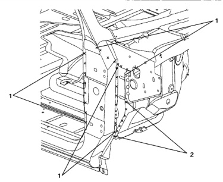

### Side Aperture (Regular Cab)

Welded Parts F R No. C2 C20 + C32 P6 9 6 each side 10 C3 + C20 + C30 9 each side ba 11 C20 + C30 + C33 P1 1 each side C20 + C33 P3 12 3 each side C23 C6 + C20 13 4 each side P4 14 C19 + C20 P34 34 each side 15 C19 + C20 + C31 2 each side P2 16 C6 + C19 + C20 7 each side P7 17 C6 + C19 1 each side P1 18 C6 + C8 + C19 2 each side P2 C8 C4 + C6 P9 19 9 each side 20 C4 + C20 7 each side P7 21 C4 + C6 + C20 4 each side P4 22 C4 + C7 P4 Welded Parts F 4 each side R 23 C5 + C8 ಹಿ C20 + C30 27 each side P27 9 each side C5 + C6 + C20 C15 + C30 7 each side P7 24 10 each side P10 P3 25 C5 + C8 + C27 P2 C20 + C24 3 each side 2 each side 26 P6 C20 + C23 + C24 28 each side P28 C2 + C22 6 each side C17 +C23 + C24 1 each side P1 27 C3 + C22 6 each side P6 P1 C20 + C22 P4 C17 + C24 1 each side 28 4 each side C20 + C31 P15 ನಿತ C4 + C22 2 each side P2 15 each side C23 + C31 4 each side P4

*Fig. 1*

C3

No.

1

2

3

4

5

6

7

8

*Fig. 2*
