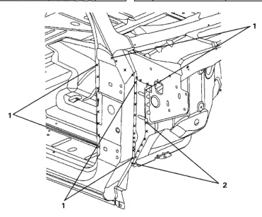

### Side Aperture (Club Cab)

No. Welded Parts F R 9 C20 + C32 P6 6 each side C3 + C20 + C30 ති 10 9 each side P1 11 C20 + C30 + C33 1 each side 12 C20 + C33 P3 3 each side P4 13 C6 + C38 4 each side 14 C20 + C49 6 each side P6 15 C36 + C38 32 each side P32 16 C20 + C36 2 each side P2 C20 + C36 + C38 P19 17 19 each side 18 C38 + C39 + C40 3 each side છે3 19 C20 + C39 + C40 P49 49 each side 20 C20 + C38 + C40 6 each side P6 21 C20 + C38 3 each side ജ No. Welded Parts F 22 C27 + C37 3 each side ા્ડ R C20 + C30 23 C36 + C37 13 each side P13 1 27 each side P27 2 C15 + C30 24 C20 + C37 + C38 P4 7 each side P7 4 each side 25 C37 + C40 3 C20 + C24 3 each side P3 7 each side P7 4 C20 + C23 + C24 C37 + Tapping Plate P4 28 each side P28 26 4 each side Seat Belt O/B Anchor 5 C17 +C23 + C24 P1 1 each side 27 C37 + C40 P7 7 each side 6 C17 + C24 1 each side P1 28 C8 + C37 + C38 P6 6 each side 7 C20 + C48 P15 15 each side 8 C23 + C48 P4 4 each side

*Fig. 1*
