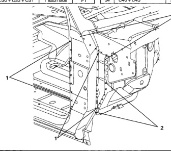

### y Side Aperture (Quad Cab)

F R No. Welded Parts 12 C33 + C51 3 each side БЗ C52 13 C39 + C40 + C51 51 each side PS1 C40 + C51 + C57 5 each side P5 14 C51 C39 + C51 17 each side P17 15 P2 16 C39 + C51 + C52 2 each side 6 each side P6 17 C31 + C39 + C51 ર્જિ 18 C9 + C40 5 each side C.28 P2 C8 + C40 + C52 2 each side 19 20 C40 + C52 2 each side P2 21 C52 + C55 16 each side P16 C51 + C53 + C55 P10 22 10 each side 23 C51 + C54 + C55 2 each side bS F 24 C39 + C51 + C55 2 each side P2 No. Welded Parts R C51 + C52 PS 1 25 5 each side C30 + C51 8 each side િકે 26 C1 + Tapping Plate 4 each side P4 2 C15 + C30 7 each side P7 RR Seat Belt Anchor ‌‌‌ C24 + C51 РЗ 3 each side 27 C51 + C52 + C53 22 each side P22 4 C23 + C24 + C51 28 each side P28 5 28 C51 + C53 4 each side P4 C17 +C23 + C24 1 each side P1 29 C51 + C52 P38 6 C17 + C24 1 each side P1 38 each side 7 30 C27 + C54 1 each side P1 C48 + C51 14 each side P14 31 C27 + C53 + C54 P4 8 C23 + C48 РЗ 4 each side 3 each side 32 P3 C8 + C51 + C54 3 each side 9 C35 + C51 6 each side P6 10 C3 + C30 + C51 9 each side Р9 33 C27 + C54 5 each side P5 11 C30 + C33 + C51 34 C40 + C45 5 each side bરે P1 1 each side

*Fig. 1*
