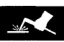
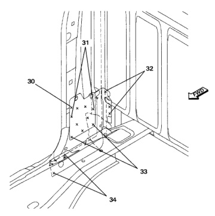

· The side aperture is a multilayer assembly. Use care when separating panels to avoid unnecessary damage.

· The side aperture may be sectioned using the proper non-structural repair procedures.

1. Using a spot weld cutter or hole saw, carefully cut all spot welds at indicated locations.

2. Using an air chisel, separate damaged panels and remove.

3. It may be necessary to remove undamaged panels to gain access to panel being replaced.

*Fig. 1*

1. Clean and remove old adhesive and sealers from panels.

2. Grind and prep all panel flanges.

3. Using old panels, transfer weld locations to new panel.

1. Install new panel, fit and align, then clamp in place.

2. Recheck alignment and fit, tack weld.

3. Complete all spot or plug weld as required.

4. Treat all welds and panels with anticorrosion materials as required.

5. Apply sealers as required.

*Fig. 2*
