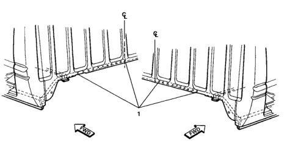

### b Back Panel (Regular Cab)

Welded Parts F R No. C C6 + C8 P12 6 12 each side 7 C6 + C8 3 each side P3 8 C6 + C7 + C8 P1 1 each side C7 + C8 P11 9 11 each side C6 C7 + C8 10 9 each side ba C15 C18 Welded Parts F No. R C8 + C18 21 P21 1 2 C8 + C18 1 each side P1 C8 + C18 + C19 1 each side ‌‌‌ P1 C8 + C19 P7 4 7 each side 5 C6 +CB + C19 P1 1 each side

*Fig. 1*
