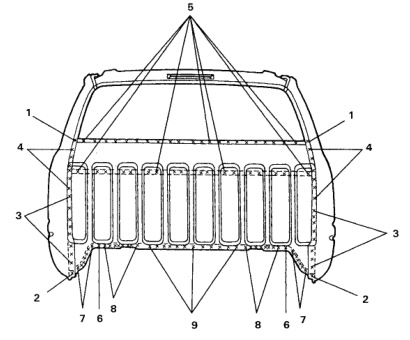

### b Back Panel (Club Cab)

No. Welded Parts F R C36 6 C8 + C18 ଚ୍ଚ 1 each side 7 C8 + C19 7 each side P7 8 C8 + C18 8 each side P8 C7 C38 C8 + C18 + Seat Belt ਰੇ 12 P12 Reinforcement 10 C4 + C6 +C8 3 each side РЗ C7 + C8 + Reinforce- 11 4 each side P4 ment Extension C4 + C6 + Reinforce- 12 2 each side P2 C405 ment Extension 13 C4 + C6 + Reinforce- 3 each side P3 C42 ment Extension C4 + Reinforcement 14 3 each side РЗ Extension Welded Parts No. F R 15 C5 + C8 11 P11 1 C6 + C7 +C8 1 each side P1 2 C6 + C8 + C19 1 each side P1 3 C5 + C6 + C8 8 each side ങ്ങ 4 C4 + C6 + C8 6 each side P6 5 C7 +C8 P40 40

*Fig. 1*
