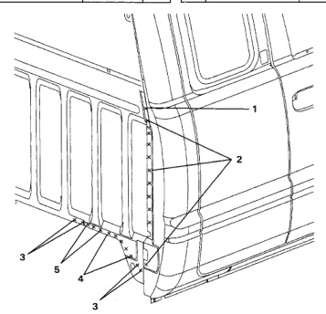

### Cab Back Panel (Quad Cab)

Welded Parts F No. R CE3 5 C8 + C41 + Reinforce- 3 each side P3 C7 ment Cab Back Lower C52 6 C34 + C52 20 each side P20 CB CE C40 C41 F No. Welded Parts R C8 + C52 P1 1 1 each side న C8 + C51 + C52 P1 1 each side 3 C8 + C40 8 each side P8 C8 + C40 + Reinforce- 4 5 each side bર ment Cab Back Lower

*Fig. 1*
