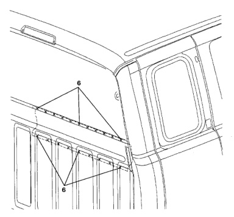

· To replace this panel, it will be necessary to remove the inner trim around the rear window area.

· The rear window will need to be removed as well as the cargo box.

· Use caution when welding or grinding; cover, remove or protect all flammable materials from sparks.

1. Using a spot weld cutter or hole saw, carefully cut all spot welds where indicated. It will be necessary to remove the rear cab panel reinforcement and extensions first to gain access to hidden welds.

2. If replacing rear cab panel, it may be cut into smaller sections to aid in removal.

*Fig. 1*

1. Clean all weld surfaces and remove old sealers.

2. Transfer weld location points to new panels using damaged panel as a guide/template if possible.

1. The new panel will have to be installed from inside the cab and worked into place.

2. Clamp or tack weld into place.

3. Recheck fit and alignment.

4. Complete all plug welds.

5. Finish exterior surfaces at weld locations.

6. Apply anti-corrosion and sealing materials as necessary.

*Fig. 2*
