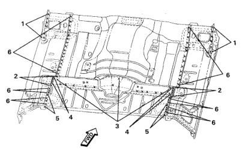

### r Pan (Regular Cab)

No. Welded Parts F R C18+ C19 P22 ნ 22 each side 7 C9 + C18 8 each side P8 8 C9 + C19 14 each side P14 C18 9 C9 + C19 7 each side P7 10 C10 + C18 P4 4 each side 11 C10 + C19 8 each side P8 12 C12 + C18 P5 5 each side C18 + C19 13 2 each side P2 14 C10 + C19 + C33 7 each side P14 C9 C12 C10 F Welded Parts R No. P6 1 C19 + C23 6 each side C12 + C18 + C19 2 each side P2 N P17 3 C12 + C18 17 P4 4 C12 + C18 + C19 4 each side 5 C9 + C18 + C19 2 each side P2

*Fig. 1*
