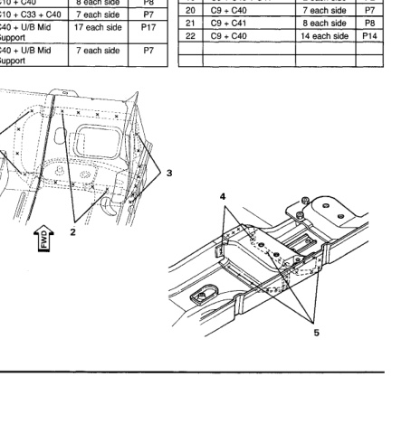

### Pan (Club Cab)

No. Welded Parts F R P68 6 C40+ C41 68 7 C40 + C47 14 P14 8 C40 + C41 +C47 ზ ଚ୍ଚି P30 9 C41 + C47 30 10 C41 + C45 26 P26 C40 + C44 + Front 11 12 P12 Seat Rear O/B Supt. 12 C40 + C41 + C44 12 P12 13 C41 + C44 51 P51 C41 + C44 + C45 P4 14 4 15 C40 + Tapping Plate - 30 P30 Support Mtg. 16 C41 + C45 12 P12 17 C9 + C41 + C43 8 P8 No. Welded Parts F R 18 C41 + C43 22 ь55 C10 + C41 P4 1 4 each side 19 C9 + C40 + C41 P2 2 each side 2 C10 + C40 P8 8 each side P7 20 C9 + C40 7 each side C10 + C33 + C40 P7 3 7 each side 21 C9 + C41 8 each side P8 4 C40 + U/B Mid 17 each side P17 22 C9 + C40 14 each side P14 Support 5 C40 + U/B Mid 7 each side P7 Support

*Fig. 1*
