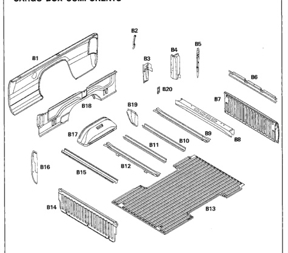

*Fig. 1*

*Fig. 2*

B11 Box, Center Crossmember Box, Crossmember (8 foot only) B12 B13 Box, Floor Panel B14 Box, Front Center Panel B15 Box, Front Crossmember B16 Box, Side Front Panel B17 Rear Wheelhouse Inner Panel BIB Box, Side Inner Panel B19 Box, Side Wheelhouse Outer Extension B20 Tailgate Hinge Reinforcement

B1 B2 B3 84 B5 B6 87 88 89 B10

Box, Side Outer Panel Taillamp Mounting Bracket Rear Corner to Rear Sill Gusset Outer Rear Corner Reinforcement Box, Side Rear Reinforcement Tailgate Center Reinforcement Tailgate Panel Box, Rear Crossmember Box, Crossmember Box, Center Crossmember

8
