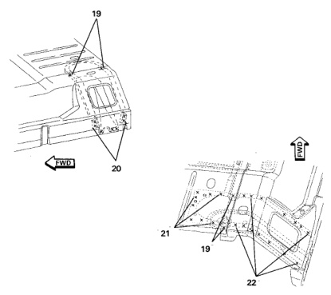

· The floor pan is made up of three separate panels. Each panel can be replaced individually.

· Replacing any of these panels is difficult. Many other panels and components have to be removed to gain access to the damaged panel. Use care not to damage other panels.

1. Refer to cowl, side aperture and cab back panel sections for additional weld location information.

2. Carefully cut all spot welds and remove undamaged panels.

*Fig. 1*

1. Using damaged panel, transfer weld locations to new panel.

2. Clean and prep all panel attaching surfaces.

1. Align and temporarily tack weld new panel into place.

2. Recheck for fit and alignment.

3. Complete all plug welds.

4. Reinstall all remaining panels.

5. Apply sealer and anti-corrosion materials as required.

*Fig. 2*
