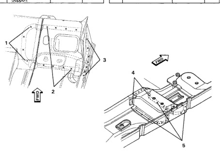

### Pan (Quad Cab)

Welded Parts F R No. 6 C40+ C41 ୧୫ P68 7 C40 + C47 14 P14 8 C40 + C41 +C47 ഗം P6 9 C41 + C47 30 P30 C41 + C45 10 26 P26 C40 + C44 + Front 12 P12 11 Seat Rear O/B Supt. C40 + C41 + C44 12 P12 12 13 C41 + C44 51 P51 14 C41 + C44 + C45 4 P4 15 C40 + Tapping Plate - 30 P30 Support Mtg. 16 C41 + C45 12 P12 C9 + C41 + C43 17 8 P8 F No. Welded Parts R 18 C41 + C43 22 P22 1 C10 + C41 4 each side P6 19 C9 + C40 + C41 2 each side P2 ‍‍‍ C10 + C40 8 each side P2 20 C9 + C40 7 each side P7 C10 + C33 + C40 7 each side P17 ‌‌‌ P8 21 C9 + C41 8 each side 4 C40 + U/B Mid 17 each side P4 22 C9 + C40 14 each side P14 Support 5 C40 + U/B Mid 7 each side P2 Support

*Fig. 1*
