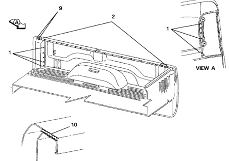

### argo Box Outer Side Panel

B2 No. Welded Parts F R 5 B1 + B18 22 each side P22 BS B1 ზ B1 + B16 16 each side P16 7 B4 + B5 11 each side P11 B4 + B5 + Rear Stake 8 3 each side РЗ Pocket Reinforcement 9 B1 + B18 2 each side P2 10 B1 + B18 Expandable Foam BB Adhesive 84 вз B16 No. Welded Parts F R B1 + B2 5 each side P5 1 2 B1 + B18 (6 ft.) P21 21 each side 2 B1 + B18 24 each side P24 3 B1 + B5 14 each side P14 4 LH B1 + B3 P4 4 each side 4 RH B1 + B3 РЗ 3 each side

*Fig. 1*
