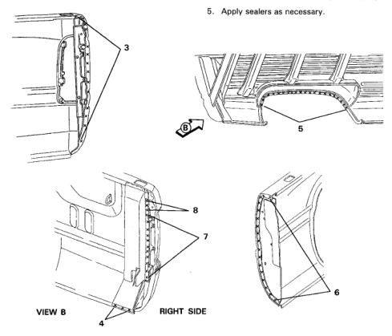

· Refer to Cargo Box Front Panel section for additional information.

· It will be necessary to remove the cargo box from the vehicle for this repair.

· Use caution when working on left side near fuel filler location.

1. With cargo box properly supported, carefully remove all spot welds using weld cutter.

2. Use caution not to damage any adjacent panels.

*Fig. 1*

1. Clean and prep all panels not being replaced.

2. Remove primer coating at areas to be welded on new panel(s).

3. The taillamp support bracket (B2) can be welded in place before the panel on the box.

1. Install new panel on cargo box; align and clamp in place.

2. Tack weld new panel and recheck alignment and fit.

3. Complete spot and/or plug welding.

4. Treat all welds with anti-corrosion material.

*Fig. 2*
