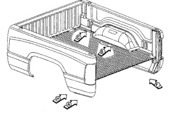
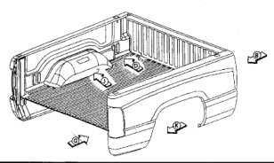

### rgo Box Inner Side Panel

Welded Parts F R No. ნ B13 + B16 (8ft. only) 15 each side P15 B5 B17 7 B13 + B17 17 each side P17 8 B4 + B8 P7 7 each side 9 B4 + B8 P5 5 each side 88 10 B4 + B8 + B13 9 each side ba RtR P12 11 B18 + Center Stake 12 each side Pocket reinforcement 12 B18 + Stake Pocket 6 each side P6 13 B4 + B18 10 each side P10 14 B10 + Front Stake 6 each side P6 B13 Pocket B16 15 B17 + B18 24 each side P24 Welded Parts F No. R B4 + B5 P14 1 14 each side 2 B16 + B18 11 each side P11 3 B13 + B18 8 each side P8 4 B13 + B17 3 each side b3 5 B13 + B18 (8 ft. only) 14 each side P14

*Fig. 1*

*Fig. 2*
