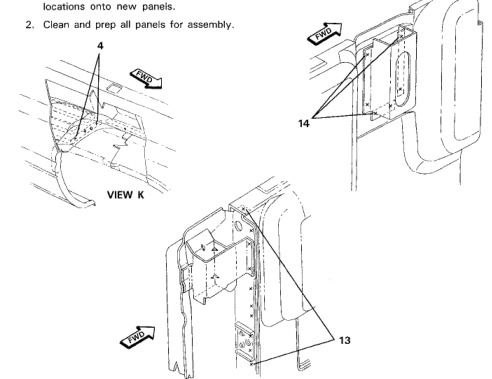

· Refer to Cargo Box Front Panel and Outer Side Panel sections for additional weld location information.

· If replacing outer panel also, the inner and outer cargo box panels can be removed as an assembly.

1. Locate and cut all spot welds using a spot weld cutter or 5/16" hole saw.

2. Use care when removing damaged panels not to cause unnecessary damage to panels not being used.

1. Using old panels, measure and locate weld

*Fig. 1*

1. Temporarily attach all brackets and extensions panels to inner cargo box panel.

2. Recheck measurments, then weld in place.

3. Temporarily secure inner panel assembly to remainder of cargo box.

4. Place outer box panel in place and check for fit and alignment. Adjust inner and outer box panels as necessary.

5.

Remove outer box panel and weld inner panel at spot weld locations.

Install outer panel as outlined in cargo box outer panel section.

6.

7. Apply sealer and corrosion protection as necessarv.

*Fig. 2*
