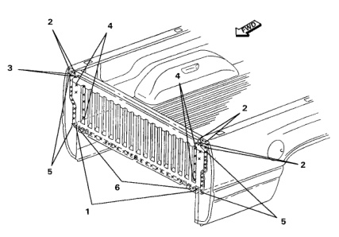

### Cargo Box Front Panels

F R No. Welded Parts B1 6 B13 + B14 26 P26 7 B1 + B16 P15 15 each side B18 B16 B13 B14 No. Welded Parts F R B14 + B16 + B18 1 1 each side P1 B1 + B14 P3 N 3 each side 3 B14 +B16 4 each side P4 B14 + B16 P7 4 7 each side B14 + B16 + B18 5 11 each side P11

*Fig. 1*
