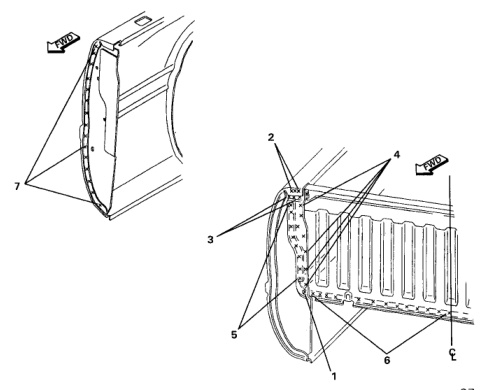

· The front box panel consists of three sections.

· Use care when removing panel to be replaced, so as not to damage surrounding panels that are not being replaced.

1. Use a spot weld cutter to remove spot welds.

2. Carefully spread box sides to remove front box panel.

1. Clean and prepare all remaining panels.

2. If possible, use damaged panel as a pattern to locate spot or plug welds on new panel.

*Fig. 1*

1. Carefully spread box sides and slip front panel into place.

2. Secure panel in place with clamps.

3. Recheck alignment and fit, and tack weld.

4. Secure panel with plug or spot welds.

5. Apply sealers in specified areas.

6. Treat all welded areas with anti-corrosion material.

*Fig. 2*
