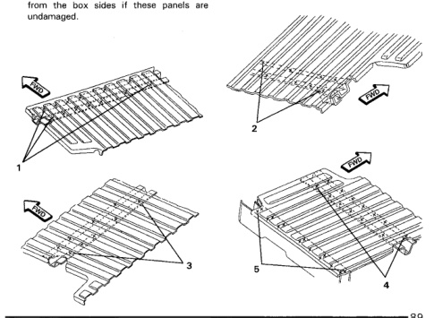

· Refer to Inner Box Side and Front Panel replacement sections for additional information.

· ALL replacement crossmembers come as complete assemblies with gussets and top plates already installed.

· If replacing crossmember(s) only, remove welds for that crossmember only.

1. Remove cargo box from vehicle. Place box upside down on a suitable stand or on the floor. Support box floor from underside also.

2. Before starting floor panel removal, measure the locations of all crossmembers and transfer measurements to new panel.

3. Carefully cut and separate the spot welds attaching the box floor to the front and side panels using a 5/16" or 3/8" hole saw.

4. It is not necessary to separate the front panel from the box sides if these panels are undamaged.

*Fig. 1*

1. Use old floor panels as a guide for locating weld points on new floor panel.

2. Clean and prep all panels.

3. Position and weld crossmembers to new floor panel using measurments from old floor panel as a guide.

1. Place new floor panel into position with box sides and front panel, and clamp in place.

2. Check all measurments and alignments.

3. Tack weld new panel to adjacent panels.

4. Recheck measurments and alignments.

5. Plug weld all panels to factory specifications.

6. Apply seam sealer and anti-corrosion materials as necessary.

*Fig. 2*
