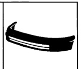
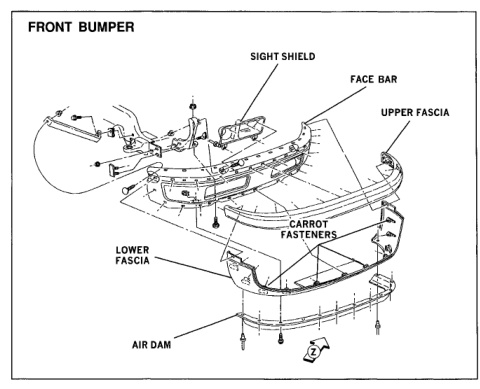

*Fig. 1*

### BUMPER SYSTEMS

### Dodge Ram Pickup

The front bumper consists of a high-strength steel face bar (painted on base vehicles and chromed with the laramie SLT package) with molded upper and lower plastic fascias. The optional rear step burnper is the lightest and strongest in the industry. The bumper has a onepiece stamped steel face coupled with a reinforcement tube for strength. The outer

ourface is chrome plated while the inner surface and reinforcement tube are painted to help prevent corrosion. The fascias are attached to the bumper which is then secured to the body via bumper reinforcement brackets. The bumper systems are designed to meet all federal safety standards.

*Fig. 2*
