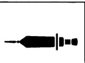
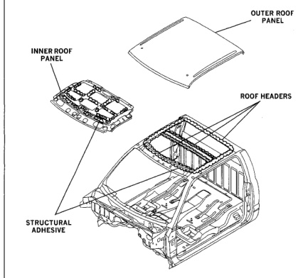

### STRUCTURAL ADHESIVES

### Dodge Ram Pickup

Structural adhesive is used to bond panels for cosmetic or assembly reasons. There are many other benefits to using structural adhesives.

.

.

*Fig. 1*

For example:

Minimal or no welding required

•

• Added strength

Reduced panel distortion

INNER AND OUTER ROOF PANELS (QUAD CAB)

*Fig. 2*
