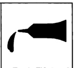
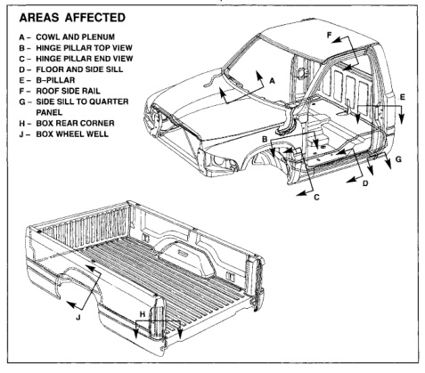

*Fig. 1*

### BODY SEALING LOCATIONS

### Dodge Ram Pickup

All repairs where panels are replaced may have voids that must be filled with sealant. Sealant also should be applied to sealer skips, pin holes and weld burn-through holes on the interior and exterior of the vehicle that would permit leakage of water, air or exhaust fumes.

Typical areas of the exterior that must be sealed are listed on this page. Typical areas of the interior that must be sealed are floor pans, wheelhouses, dash panel and cowl sides. Unless noted, all illustrations show the regular cab; sealing locations are similar for the club and quad cab.

*Fig. 2*
